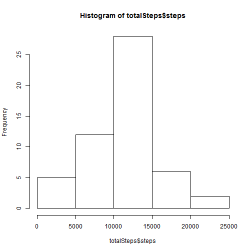
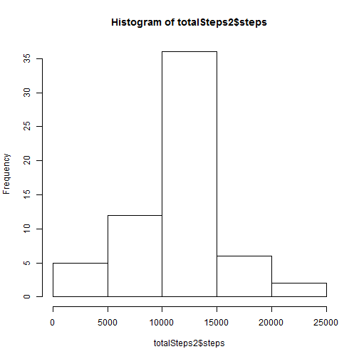

```r
# Set working directory

setwd("C:/Users/Ivana/Desktop/repdata-data-activity/")

# Import data

activity <- read.csv("activity.csv")
```


```r
totalSteps <- aggregate(steps ~ date, data = activity, sum, na.rm = TRUE)
```

## What is mean total number of steps taken per day?

```r
# Make a histogram of the total number of steps taken each day

hist(totalSteps$steps)
```

 

```r
# Calculate and report the mean and median total number of steps taken per day

mean(totalSteps$steps)
```

```
## [1] 10766
```

```r
median(totalSteps$steps)
```

```
## [1] 10765
```

The mean total number of steps taken per day is 10766 steps.
The median total number of steps taken per day is 10765 steps.

## What is the average daily activity pattern?


```r
# 1.) Make a time series plot (i.e. type = "l") of the 5-minute interval (x-axis) and the average number of steps taken, averaged across all days (y-axis)

stepsInterval <- aggregate(steps ~ interval, data = activity, mean, na.rm = TRUE)


plot(steps ~ interval, data = stepsInterval, type = "l")
```

 

```r
# 2.) Which 5-minute interval, on average across all the days in the dataset, contains the maximum number of steps?

stepsInterval[which.max(stepsInterval$steps), ]$interval
```

```
## [1] 835
```

It is the 835th interval.


## Imputing missing values


```r
sum(is.na(activity$steps))
```

```
## [1] 2304
```

```r
interval2steps <- function(interval) {
  stepsInterval[stepsInterval$interval == interval, ]$steps
}


activityFilled <- activity  # Make a new dataset with the original data
count = 0  # Count the number of data filled in
for (i in 1:nrow(activityFilled)) {
  if (is.na(activityFilled[i, ]$steps)) {
    activityFilled[i, ]$steps <- interval2steps(activityFilled[i, ]$interval)
    count = count + 1
  }
}
cat("Total ", count, "NA values were filled.\n\r")
```

```
## Total  2304 NA values were filled.
## 
```

```r
totalSteps2 <- aggregate(steps ~ date, data = activityFilled, sum)
hist(totalSteps2$steps)
```

 

```r
mean(totalSteps2$steps)
```

```
## [1] 10766
```

```r
median(totalSteps2$steps)
```

```
## [1] 10766
```

2304 rows are missing.
The mean total number of steps taken per day is 10766 steps.
The median total number of steps taken per day is 10766 steps.
These estimates differ slighltly from the estimates from the first part of assignment. 


## Are there differences in activity patterns between weekdays and weekends?


```r
activityFilled$day = ifelse(as.POSIXlt(as.Date(activityFilled$date))$wday%%6 == 
                              0, "weekend", "weekday")
# For Sunday and Saturday : weekend, Other days : weekday
activityFilled$day = factor(activityFilled$day, levels = c("weekday", "weekend"))

stepsInterval2 = aggregate(steps ~ interval + day, activityFilled, mean)
library(lattice)
xyplot(steps ~ interval | factor(day), data = stepsInterval2, aspect = 1/2, 
       type = "l")
```

 

There are differences in activity oatterns between weekends and weekdays.


